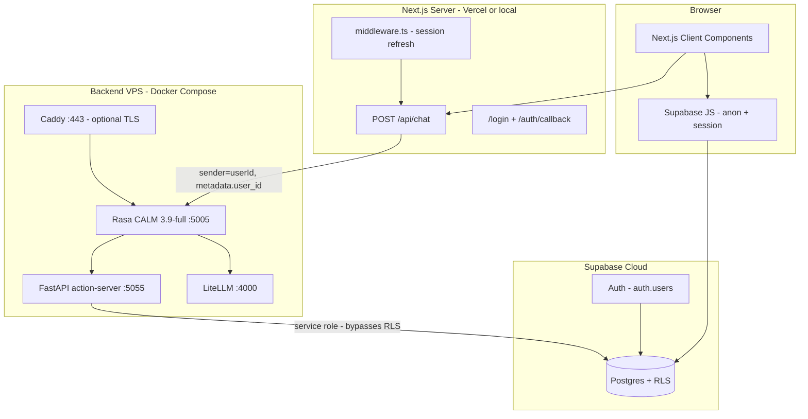
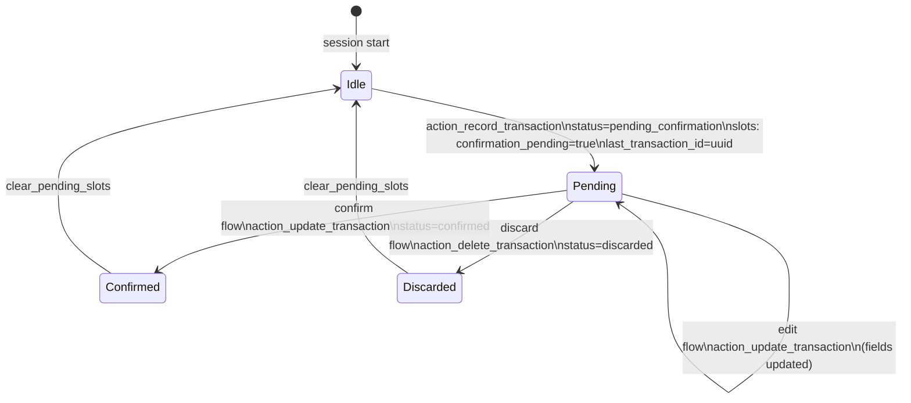

# Finguard — System Design Review & Improvement Plan

> **Hobby project?** Read **[ARCHITECTURE.md](./ARCHITECTURE.md)** (stack) and **[IMPROVEMENT_PLAN.md](./IMPROVEMENT_PLAN.md)** (what to do next).
> This document is a detailed review for later hardening; you do not need it to build locally.

**Date:** 2026-05-27
**Status:** Living document (optional / scale-up reference)
**Audience:** Engineers and agents working on Finguard
**Scope:** Full monorepo (`frontend/`, `backend/`, `supabase/`, `docs/`)

**Related docs:**

- [Rasa CALM Backend Plan](./rasa-calm-backend-plan.md)
- [Implementation Tracker](./IMPLEMENTATION_TRACKER.md)
- [Next.js Implementation Plan](./nextjs-implementation-plan.md)
- [Prototype to Product Options](./prototype-to-product-options.md)

---

## Executive summary

Finguard is a **personal finance chat assistant** with a sound architectural direction: **Next.js (BFF + UI) → Rasa CALM (conversation control) → FastAPI action server (mutations) → Supabase Postgres (system of record)**. Recent work (Phase 5b) removed the worst redundancy—`localStorage` vs database and dual NLU in production—by making Supabase the source of truth and gating legacy OpenAI parse behind a flag.

The codebase is **strong on design intent, module boundaries, and local unit tests** for a project at this stage. It is **not yet proven end-to-end**: Docker/Rasa training, live LLM flows, migrations in a real Supabase project, and CI are incomplete or manual. The largest risks before any real users are **(1) unauthenticated access to Rasa if exposed**, **(2) service-role DB writes trusting `user_id` from conversation metadata**, and **(3) split state between Rasa slots, UI metadata, and Postgres rows**.

This document scores seven dimensions, explains each score, and lists **concrete actions** to raise every scorecard toward production readiness.

---

## Table of contents

1. [System context](#1-system-context)
2. [Component inventory](#2-component-inventory)
3. [What we do well](#3-what-we-do-well)
4. [Incomplete implementation](#4-incomplete-implementation)
5. [Threat model](#5-threat-model)
6. [Pending transaction state machine](#6-pending-transaction-state-machine)
7. [Data consistency & contracts](#7-data-consistency--contracts)
8. [Scorecards](#8-scorecards)
9. [Improvement actions by scorecard](#9-improvement-actions-by-scorecard)
10. [Consolidated roadmap](#10-consolidated-roadmap)
11. [CI and Docker smoke specification](#11-ci-and-docker-smoke-specification)
12. [Appendix](#12-appendix)

---

## 1. System context

### 1.1 Runtime architecture



### 1.2 Trust boundaries

| Boundary | Trusted party | Untrusted input |
|----------|---------------|-----------------|
| Browser → Next.js | Supabase session cookie | Request body (`message`) |
| Next.js → Rasa | Authenticated `user.id` from Supabase | Rasa response JSON |
| Rasa → Actions | Slots + `sender_id` / metadata | LLM-extracted slot values |
| Actions → Postgres | Pydantic-validated inserts | DB responses (validate shape) |
| Browser → Supabase | JWT + RLS | N/A for direct client reads |

### 1.3 Deployment split (as designed)

| Surface | Host | Notes |
|---------|------|-------|
| Frontend + `/api/chat` | Vercel (planned) | Needs `RASA_URL` to private/VPS URL |
| Rasa + LiteLLM + actions | Hetzner VPS | `backend/docker-compose.yml` |
| Database + Auth | Supabase | Migrations in `supabase/migrations/` |

**Gap:** No runbook ties Vercel env, VPC/firewall, and Caddy together. Caddy in Compose assumes TLS termination on VPS while the app UI may live elsewhere.

---

## 2. Component inventory

### 2.1 Frontend (`frontend/`)

| Area | Key paths | Role |
|------|-----------|------|
| Chat UI | `src/features/chat/ChatWorkspace.tsx` | Messages, send, confirm/discard, dashboard |
| Auth | `src/features/auth/LoginForm.tsx`, `useSession.ts` | Email/password, session |
| Supabase | `src/lib/supabase/{client,server,middleware}.ts` | SSR cookies, RLS client |
| Data access | `src/lib/data/financial-data.ts`, `map-db-row.ts` | Load/persist txs & messages |
| BFF | `src/app/api/chat/route.ts` | Auth + Rasa proxy |
| ~~Legacy parse~~ | ~~removed~~ | **Removed** — use `/api/chat` → Rasa only (see ARCHITECTURE.md) |
| Reports | `src/features/reports/finance-calculations.ts` | Client-side aggregates |

**Tests:** 3 Vitest files, 9 tests (`map-rasa-responses`, `map-db-row`, `resolve-user`).

### 2.2 Backend (`backend/`)

| Area | Key paths | Role |
|------|-----------|------|
| Actions | `actions/handlers/*.py` (7 actions) | DB mutations + dispatcher messages |
| DB layer | `actions/db/queries.py`, `client.py` | Typed queries, service-role client |
| Models | `actions/models/transaction.py` | Pydantic row/insert/update |
| Server | `actions/server.py` | FastAPI wrapper over rasa-sdk executor |
| Rasa | `rasa/data/flows/*.yml`, `domain.yml` | CALM flows |
| LLM | `litellm/config.yaml` | Gemini + DeepSeek routing |
| Docker | `docker-compose.yml` | rasa, action-server, litellm, caddy |

**Actions registered:**

| Action | Handler | Purpose |
|--------|---------|---------|
| `action_session_start` | `session_start.py` | Load profile → slots |
| `action_record_transaction` | `record_transaction.py` | Insert pending tx |
| `action_update_transaction` | `update_transaction.py` | Confirm / edit pending |
| `action_delete_transaction` | `delete_transaction.py` | Discard pending |
| `action_get_balance` | `get_balance.py` | Balance report |
| `action_query_spending` | `query_spending.py` | Category spending |
| `action_list_transactions` | `list_transactions.py` | List txs |

**Tests:** 6 pytest modules (~16 tests): dates, pending helpers, server health, 2 handler suites.

**Tracker:** `InMemoryTrackerStore` in `rasa/endpoints.yml` — single-instance only.

### 2.3 Database (`supabase/migrations/`)

| Migration | Contents |
|-----------|----------|
| `20260527000000_initial_schema.sql` | `profiles`, `transactions`, `chat_messages`, RLS |
| `20260527000001_balance_rpc.sql` | `get_balance_summary()` SECURITY DEFINER |

**Missing from migrations:**

- Trigger to create `profiles` row on `auth.users` insert
- `updated_at` triggers
- Seed/dev helpers

### 2.4 Documentation & tooling

- Planning docs are detailed and aligned with code direction.
- Pre-commit: ruff, pyright, bandit, biome, gitleaks, codespell, commitizen.
- **No GitHub Actions / CI workflows** in repo.
- Graphify knowledge graph (`graphify-out/`) for navigation.

---

## 3. What we do well

### 3.1 Architecture and product fit

- **CALM flows for money** instead of unconstrained LLM tool use reduces hallucinated mutations and cost.
- **Postgres + RLS** matches multi-user finance; documented early in `prototype-to-product-options.md`.
- **BFF pattern** keeps LLM keys and Rasa URL off the client.

### 3.2 Code organization

- Handlers are single-purpose; validation uses Pydantic at action boundary.
- Frontend features colocated (`chat/`, `transactions/`, `reports/`, `auth/`).
- Supabase access centralized in `lib/data/` after Phase 5b.

### 3.3 Schema design

- Transaction lifecycle: `pending_confirmation` → `confirmed` | `discarded`
- `source`, `ai_confidence`, currency, timezone hooks on profile
- Indexes on hot query paths

### 3.4 Engineering hygiene

- `uv.lock` + websockets override documented for supabase/rasa-sdk conflict
- Structured logging (Loguru) with action name + sender
- Legacy paths explicitly flagged in env (`ENABLE_LEGACY_AI_PARSE`, `ENABLE_DEV_USER_FALLBACK`)

### 3.5 Testing culture (for current size)

- Handler tests mock Supabase; they test outcomes not SQL strings
- Rasa custom payload mapping covered in Vitest
- E2E YAML exists under `backend/rasa/tests/` (not yet run in CI)

---

## 4. Incomplete implementation

### 4.1 P0 — Blocks production

| ID | Gap | Evidence |
|----|-----|----------|
| P0-1 | End-to-end stack unverified | `IMPLEMENTATION_TRACKER.md`: Docker train/up unchecked |
| P0-2 | Migrations not automated | Manual checklist only |
| P0-3 | No CI | No `.github/workflows/` |
| P0-4 | Rasa network exposure | `docker-compose.yml`: `--cors "*"`; port 5005 published |
| P0-5 | Profile bootstrap | No insert on signup; `session_start` tolerates missing profile |
| P0-6 | Rasa impersonation | `sender` = `userId` from Next; Rasa does not verify JWT |

### 4.2 P1 — User-visible correctness

| ID | Gap | Impact |
|----|-----|--------|
| P1-1 | Reports from client aggregates | `map-api-messages.ts` uses `computeReportData(transactions)` |
| P1-2 | Chat message ID mismatch | Client ids vs DB UUIDs; confirm UI breaks after reload |
| P1-3 | Dual pending state | Rasa slots `confirmation_pending` vs UI `txStatus` in metadata |
| P1-4 | Category casing | Backend lowercase; UI title-case on read |
| P1-5 | Reset wipes all data | `clearUserFinancialData()` hard-deletes |
| P1-6 | Rasa does not write `chat_messages` | Only frontend persists chat log |

### 4.3 P2 — Scale and ops (planned Phase 6)

| ID | Gap |
|----|-----|
| P2-1 | Rate limiting |
| P2-2 | Redis tracker store |
| P2-3 | Deploy runbook (Vercel ↔ VPS) |
| P2-4 | Playwright E2E |
| P2-5 | Observability (metrics, tracing, LLM cost) |
| P2-6 | Pin `latest` npm dependencies |

---

## 5. Threat model

### 5.1 Assets

| Asset | Sensitivity |
|-------|-------------|
| Transaction rows | High — personal financial data |
| Auth sessions | High |
| Service role key | Critical |
| LLM API keys | High (cost + abuse) |
| Chat content | Medium–High |

### 5.2 Threat scenarios

#### T1 — Rasa sender spoofing (High if Rasa is public)

**Attack:** Caller POSTs to `RASA_URL/webhooks/rest/webhook` with `sender: <victim-uuid>`.

**Current controls:** Next.js only sends `sender` after Supabase `getUser()`. Rasa itself does not validate JWT.

**Impact:** Attacker drives victim’s flows; actions write to victim `user_id` via service role.

**Mitigations (pick one or combine):**

1. Do not expose port 5005 to the internet; firewall to Next server IP only.
2. Add shared secret header (`X-Finguard-Webhook-Secret`) checked by a small proxy in front of Rasa.
3. Terminate TLS at Caddy with mutual TLS or allowlist.

#### T2 — Service role query omission (High impact, low probability)

**Attack:** Bug in `actions/db/queries.py` omits `.eq("user_id", user_id)`.

**Current controls:** Code review; explicit `user_id` in function signatures.

**Mitigations:**

1. Add pytest that asserts every query builder includes `user_id` (meta-test or integration with query spy).
2. Prefer Supabase RPCs with `p_user_id` argument for sensitive reads (pattern started with `get_balance_summary`).
3. Periodic audit checklist in PR template.

#### T3 — LLM prompt injection via chat message (Medium)

**Attack:** User message manipulates CALM to extract wrong slots or skip confirmation.

**Current controls:** Flow guards (`confirmation_pending`, `if` conditions on flows).

**Mitigations:**

1. Keep mutations behind explicit confirm flow.
2. Server-side validation: reject confirm if DB row not `pending_confirmation`.
3. Log slot values on every mutation.

#### T4 — Abuse / cost (Medium)

**Attack:** Flood `/api/chat` or Rasa → LLM spend.

**Mitigations:** Rate limit per user at Next middleware; LiteLLM budgets; CAPTCHA on signup if public.

#### T5 — XSS in chat markdown (Low–Medium)

**Review:** `markdown.tsx` rendering path — ensure no raw HTML from model output.

### 5.3 Security control matrix

| Control | Status | Target |
|---------|--------|--------|
| RLS on user tables | Implemented | Keep |
| Auth on `/api/chat` | Implemented | Keep |
| Auth on Rasa REST | Missing | Add network or secret |
| Service role scoped queries | Partial | Audit + tests |
| Secrets in env only | Implemented | Keep + CI gitleaks |
| Rate limiting | Missing | Phase 6 |
| Audit log | Missing | Optional `audit_events` table |

---

## 6. Pending transaction state machine

Two parallel state machines exist today; they must stay aligned.

### 6.1 Rasa + Postgres (authoritative for money)



**Flow files:** `record_transaction.yml`, `manage_pending.yml`
**Helpers:** `actions/utils/pending.py` (`get_pending_transaction_ids`, `clear_pending_slots`)

### 6.2 Frontend UI (presentation + chat log)

| UI state | Stored in | Driven by |
|----------|-----------|-----------|
| `txStatus: pending_confirmation` | `chat_messages.metadata` | Initial card render |
| `txStatus: confirmed` | metadata + optimistic UI | `handleConfirm` before Rasa returns |
| `txStatus: discarded` | metadata | `handleCancel` |

**Confirm path in UI:** Updates metadata → sends natural language (`yes, confirm this transaction, ...`) → Rasa `confirm_pending_transaction` flow.

### 6.3 Drift scenarios

| Scenario | Symptom | Fix direction |
|----------|---------|---------------|
| User reloads mid-pending | Card shows pending but Rasa slots reset (in-memory tracker) | Redis tracker + reload slots from DB |
| UI confirmed, Rasa fails | metadata says confirmed, DB still pending | Refetch txs; drive UI only from DB status |
| Rasa confirmed, UI old | Dashboard wrong until refetch | Already refetches after turn — keep |
| Double confirm | Second insert or error | Idempotent confirm in `update_transaction` |

### 6.4 Recommended single source of truth

**Postgres `transactions.status` is authoritative for money.**
**Rasa slots are authoritative for conversation routing.**
**UI should render transaction cards from DB row when `transaction_id` is known.**

Actions:

1. After `mapApiMessagesToChat`, if payload includes `transaction.id`, fetch row from Supabase (or trust refetch after turn).
2. Disable confirm button when DB status ≠ `pending_confirmation`.
3. On session start, if DB has pending tx for user, set Rasa slots from DB (new action or extend `session_start`).

---

## 7. Data consistency & contracts

### 7.1 Custom payload contract (Rasa → frontend)

Defined implicitly in `map-rasa-responses.ts`:

| `custom.type` | UI mapping |
|---------------|------------|
| `transaction_pending` | Transaction card |
| `spending_report`, `balance` | Report bubble (text only; data from client) |
| `transaction_list` | Text |

**Gap:** No version field, no JSON Schema in repo, no contract tests against golden fixtures.

**Action:** Add `docs/schemas/rasa-custom-payloads.json` and Vitest fixtures; bump `version` on breaking changes.

### 7.2 Category normalization

| Layer | Format |
|-------|--------|
| LLM / slots | Free text |
| `TransactionInsert` validator | `.strip().lower()` |
| UI display | Title Case in `mapTransactionRow` |
| `TransactionCard` categories | Title Case enum lists |

**Risk:** User selects "Food & Dining" in UI but DB has `food & dining` — matching works if consistent; reports group by stored value.

**Action:** Store canonical slug + display label, or normalize in one shared module used by frontend and backend.

### 7.3 Chat history vs transaction log

| Event | Written by |
|-------|------------|
| User message | Frontend → `chat_messages` |
| Assistant text/custom | Frontend after Rasa response |
| Transaction rows | Rasa actions → `transactions` |

**Gap:** No unified event stream; debugging requires joining tables.

**Action (optional):** `domain_events` table or write assistant events from action server too.

---

## 8. Scorecards

Scores use a 1–10 scale. **Target** is what we should aim for before calling the product “production-ready” for early adopters.

| Dimension | Current | Target | Summary |
|-----------|---------|--------|---------|
| Vision / documentation | **8** | 9 | Plans match code; need runbooks + ADRs |
| Backend structure | **7** | 8 | Clean handlers; tighten DB access patterns |
| Frontend structure | **6** | 8 | Auth/data improved; reports + ids weak |
| Integration completeness | **4** | 8 | Docker/E2E/deploy unproven |
| Security | **5** | 8 | RLS good; Rasa edge + service role risk |
| Testing | **5** | 8 | Units ok; integration/E2E thin |
| Ops / CI | **3** | 7 | Pre-commit only; no pipeline or monitoring |

### 8.1 Rubric (how scores were assigned)

**Vision / documentation (8):** Multiple aligned plans, tracker, Phase summaries; missing operational runbooks and ADRs for key decisions (service role, deployment split).

**Backend structure (7):** Clear separation handlers/queries/models; FastAPI wrapper adds value; dependency tension (websockets); litellm package vs container overlap.

**Frontend structure (6):** Feature folders and Supabase layer are good; legacy AI tree remains; report path bypasses server; unpinned deps.

**Integration completeness (4):** Pieces exist but no recorded successful train → chat → confirm → DB → dashboard path in CI.

**Security (5):** Auth on BFF and RLS on client; Rasa trust model and service role are the weak links; no rate limits.

**Testing (5):** ~25 automated tests total for whole stack; no Playwright; Rasa e2e not in CI.

**Ops / CI (3):** Local pre-commit strong; no automated build/test on push; migrations manual.

---

## 9. Improvement actions by scorecard

Each action has an **ID**, **effort** (S/M/L), and **scorecard impact**.

### 9.1 Vision / documentation (8 → 9)

| ID | Action | Effort |
|----|--------|--------|
| DOC-1 | Add `docs/runbooks/local-development.md` (Supabase + Docker + env) | S |
| DOC-2 | Add `docs/runbooks/production-deploy.md` (Vercel + Hetzner + firewall) | M |
| DOC-3 | Add ADR: `docs/decisions/001-service-role-in-actions.md` | S |
| DOC-4 | Add ADR: `docs/decisions/002-rasa-network-trust.md` | S |
| DOC-5 | Keep `IMPLEMENTATION_TRACKER.md` updated each session | S |
| DOC-6 | Add `docs/schemas/` for Rasa payloads + API errors | M |

### 9.2 Backend structure (7 → 8)

| ID | Action | Effort |
|----|--------|--------|
| BE-1 | Audit all `queries.py` functions for mandatory `user_id` filter | S |
| BE-2 | Add `confirm_transaction(user_id, tx_id)` idempotent helper | S |
| BE-3 | Extend `session_start` to sync pending tx from DB into slots | M |
| BE-4 | Remove unused `litellm` Python dep if not called from actions | S |
| BE-5 | Add `actions/db/audit.py` helper for structured mutation logs | S |
| BE-6 | Document websockets override in `backend/README.md` with upgrade path | S |

### 9.3 Frontend structure (6 → 8)

| ID | Action | Effort |
|----|--------|--------|
| FE-1 | Pin `next`, `react`, `react-dom` to exact versions in `package.json` | S |
| FE-2 | Move `server/ai/*` to `src/legacy/ai/` or delete if flag unused | M |
| FE-3 | Map Rasa `balance` / `spending_report` to structured `ReportData` from payload | M |
| FE-4 | After `persistChatMessage`, replace local id with returned DB id | M |
| FE-5 | Drive confirm/cancel buttons from `transaction.status` in DB | M |
| FE-6 | Add profile settings page (currency, timezone) | M |
| FE-7 | Replace hard reset with “clear chat only” vs “delete all data” | S |

### 9.4 Integration completeness (4 → 8)

| ID | Action | Effort |
|----|--------|--------|
| INT-1 | Run `docker compose up` + `rasa train` once; document result in tracker | M |
| INT-2 | Implement `scripts/smoke-e2e.sh` (see §11) | M |
| INT-3 | Apply migrations to dev Supabase; add `supabase db push` to runbook | S |
| INT-4 | Wire `frontend` `RASA_URL` to VPS tunnel for local dev | S |
| INT-5 | Run `rasa test e2e` in Docker with stubbed actions | M |
| INT-6 | Add Playwright: login → chat → confirm → dashboard assertion | L |

### 9.5 Security (5 → 8)

| ID | Action | Effort |
|----|--------|--------|
| SEC-1 | Firewall Rasa :5005 to Next egress IP only | S |
| SEC-2 | Add `RASA_WEBHOOK_SECRET`; validate in Caddy or sidecar | M |
| SEC-3 | Reject `/api/chat` unless Supabase session valid (already) — add tests | S |
| SEC-4 | Rate limit `/api/chat` (Vercel middleware or Upstash) | M |
| SEC-5 | Verify `get_balance_summary` grants — not callable by `authenticated` inappropriately | S |
| SEC-6 | Review `markdown.tsx` for safe rendering | S |
| SEC-7 | Add Zod validation on all Rasa custom payloads in `map-rasa-responses.ts` | M |

### 9.6 Testing (5 → 8)

| ID | Action | Effort |
|----|--------|--------|
| TST-1 | GitHub Actions: frontend typecheck + vitest | S |
| TST-2 | GitHub Actions: backend ruff + pyright + pytest | S |
| TST-3 | Add handler tests for `get_balance`, `delete_transaction`, `session_start` | M |
| TST-4 | Contract tests: golden Rasa webhook JSON files | M |
| TST-5 | Integration test: queries.py against local Supabase (optional Testcontainers) | L |
| TST-6 | Playwright smoke in CI (against staging) | L |

### 9.7 Ops / CI (3 → 7)

| ID | Action | Effort |
|----|--------|--------|
| OPS-1 | Add `.github/workflows/ci.yml` (see §11) | S |
| OPS-2 | Add migration check job (`supabase db lint` or sqlfluff) | S |
| OPS-3 | Dependabot/Renovate for npm + uv | S |
| OPS-4 | Health check dashboard: Rasa, actions, LiteLLM URLs | M |
| OPS-5 | Structured logs → Loki/Datadog (or Supabase Log Drain) | L |
| OPS-6 | LiteLLM budget alerts | S |

---

## 10. Consolidated roadmap

### Phase A — Prove it works (1–2 weeks)

**Goal:** Integration completeness 4 → 6, Ops 3 → 5

1. INT-1, INT-2, INT-3 — Docker + smoke script + migrations
2. DOC-1, P0-5 — profile trigger migration
3. TST-1, TST-2, OPS-1 — CI baseline
4. SEC-1 — firewall Rasa

**Exit criteria:** One documented successful run: sign in → record expense → confirm → see row in Supabase → dashboard updates.

### Phase B — Correctness & security (2–3 weeks)

**Goal:** Frontend 6 → 7, Security 5 → 7, Testing 5 → 7

1. FE-3, FE-4, FE-5 — reports + ids + DB-driven buttons
2. SEC-2, SEC-4, SEC-7 — webhook secret + rate limit + payload validation
3. BE-2, BE-3 — idempotent confirm + slot sync
4. TST-3, TST-4 — more handler + contract tests

### Phase C — Production hardening (3–6 weeks)

**Goal:** All dimensions ≥ 7–8 where applicable

1. INT-6, P2-2 — Playwright + Redis tracker
2. DOC-2, OPS-4 — deploy runbook + monitoring
3. FE-6, FE-1 — settings + pinned deps
4. Remove legacy AI (FE-2) after 30 days without `ENABLE_LEGACY_AI_PARSE`

---

## 11. CI and Docker smoke specification

### 11.1 Proposed GitHub Actions workflow

**File:** `.github/workflows/ci.yml`

```yaml
name: CI

on:
  push:
    branches: [main]
  pull_request:

jobs:
  frontend:
    runs-on: ubuntu-latest
    defaults:
      run:
        working-directory: frontend
    steps:
      - uses: actions/checkout@v4
      - uses: pnpm/action-setup@v4
        with:
          version: 9
      - uses: actions/setup-node@v4
        with:
          node-version: "22"
          cache: "pnpm"
          cache-dependency-path: pnpm-lock.yaml
      - run: pnpm install --frozen-lockfile
      - run: pnpm typecheck
      - run: pnpm test

  backend:
    runs-on: ubuntu-latest
    defaults:
      run:
        working-directory: backend
    steps:
      - uses: actions/checkout@v4
      - uses: astral-sh/setup-uv@v5
      - run: uv sync
      - run: uv run ruff check actions tests
      - run: uv run pyright
      - run: uv run pytest tests/ -q
```

**Optional job `docker-smoke` (manual / nightly):** requires secrets `GEMINI_API_KEY`, `SUPABASE_*`; runs `scripts/smoke-e2e.sh`.

### 11.2 Smoke script outline

**File:** `scripts/smoke-e2e.sh` (repo root)

| Step | Command / check |
|------|-----------------|
| 1 | `cd backend && docker compose build` |
| 2 | `docker compose up -d` wait for health |
| 3 | `docker compose run --rm rasa train` |
| 4 | `curl -f http://localhost:5055/health` |
| 5 | `curl -f http://localhost:5005/status` |
| 6 | POST Rasa webhook with test `sender` + message `"spent 10 on coffee"` |
| 7 | Assert custom payload `transaction_pending` in response |
| 8 | If `SUPABASE_URL` set, query `transactions` for pending row |

### 11.3 Supabase profile trigger (recommended migration)

**File:** `supabase/migrations/20260528000000_profile_on_signup.sql`

```sql
create or replace function public.handle_new_user()
returns trigger
language plpgsql
security definer
set search_path = public
as $$
begin
  insert into public.profiles (id, display_name)
  values (new.id, coalesce(new.raw_user_meta_data->>'display_name', split_part(new.email, '@', 1)))
  on conflict (id) do nothing;
  return new;
end;
$$;

create trigger on_auth_user_created
  after insert on auth.users
  for each row execute function public.handle_new_user();
```

---

## 12. Appendix

### 12.1 Environment variables (consolidated)

| Variable | Where | Purpose |
|----------|-------|---------|
| `NEXT_PUBLIC_SUPABASE_URL` | Frontend | Supabase project |
| `NEXT_PUBLIC_SUPABASE_PUBLISHABLE_KEY` | Frontend | Anon key |
| `RASA_URL` | Frontend server | Rasa REST base |
| `ENABLE_LEGACY_AI_PARSE` | Frontend server | Legacy OpenAI path |
| `ENABLE_DEV_USER_FALLBACK` | Frontend server | Dev `sender_id` only |
| `FIN_GUARD_DEV_USER_ID` | Frontend server | UUID for API testing |
| `SUPABASE_URL` | Backend actions | Project URL |
| `SUPABASE_SERVICE_ROLE_KEY` | Backend actions | Service role |
| `GEMINI_API_KEY`, `DEEPSEEK_API_KEY` | LiteLLM/Rasa | LLM providers |
| `LITELLM_MASTER_KEY` | LiteLLM | Proxy auth |

### 12.2 Test inventory (2026-05-27)

| Package | Files | Approx tests |
|---------|-------|--------------|
| Backend pytest | 6 modules | ~16 |
| Frontend vitest | 3 files | 9 |
| Rasa e2e YAML | 1 file | Not run in CI |

### 12.3 Scorecard tracking template

Copy into `IMPLEMENTATION_TRACKER.md` when actions complete:

```markdown
## Scorecard history

| Date | Vision | Backend | Frontend | Integration | Security | Testing | Ops |
|------|--------|---------|----------|-------------|----------|---------|-----|
| 2026-05-27 | 8 | 7 | 6 | 4 | 5 | 5 | 3 |
| YYYY-MM-DD | | | | | | | |
```

### 12.4 Document maintenance

- **Review quarterly** or after any major architecture change.
- Update scores when exit criteria of a roadmap phase are met.
- Link PRs to action IDs (e.g. `SEC-2`, `FE-4`) in commit messages for traceability.

---

*End of system design review.*
