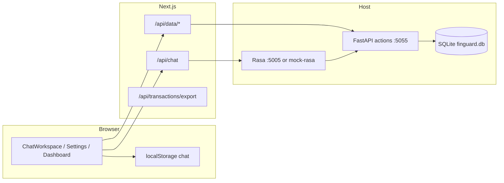

# Finguard — Comprehensive Test Strategy

**Audience:** QA/QC, engineering
**Last reviewed:** 2026-05-28
**Scope:** Monorepo (`frontend/`, `backend/`, `backend/rasa/`, `scripts/`, CI)

This document is the master plan to cover **every meaningful behavior** with the right test type. It follows TDD (red → green → refactor) for new work and extends existing Vitest, pytest, and Rasa e2e coverage.

---

## 1. Executive summary

### Current state

| Layer | Tool | Tests today | CI |
|-------|------|-------------|-----|
| Frontend unit | Vitest | **23** (9 files) | ✅ `pnpm test` |
| Backend unit | pytest + mocks | **36** (~8 modules) | ✅ `uv run pytest` |
| Rasa CALM e2e | `rasa test e2e` (YAML) | **5** cases + stubs | ⭕ manual (`scripts/rasa-e2e-docker.sh`) |
| Integration | shell smoke | partial (`smoke-e2e.sh`) | ⭕ not in CI |
| Browser E2E | — | **0** | ⭕ |
| Contract / schema | golden JSON fixtures | **2** fixture tests | ✅ via Vitest |

### Target pyramid (steady state)

```
        ~5%  Browser E2E (Playwright) — critical user journeys
       ~15%  Integration — API routes, SQLite, Rasa webhook + actions
      ~80%  Unit — pure logic, handlers (mocked DB), mappers, validators
```

### Quality gates (Definition of Done for features)

1. **RED:** Failing test(s) that describe the behavior before implementation.
2. **GREEN:** Minimal code; all existing + new tests pass.
3. **REFACTOR:** No behavior change; lint/typecheck clean.
4. **Boundary:** Any new HTTP or webhook contract has a golden fixture or route test.
5. **Flow:** Any new Rasa flow has at least one e2e case (stubbed actions in CI).

---

## 2. System under test — behavior map



### Critical paths (must never break)

| ID | Journey | Layers touched |
|----|---------|----------------|
| CP-1 | User sends expense → pending card → confirm → appears in sidebar | Rasa/mock → webhook map → UI → SQLite |
| CP-2 | User asks balance / spending report | Rasa → actions → map report → Dashboard |
| CP-3 | User discards pending | Rasa → delete handler → UI tx status |
| CP-4 | Page load hydrates transactions + chat from storage/API | `/api/data/*`, localStorage |
| CP-5 | Settings save profile | PATCH profile → Rasa slots on next session |
| CP-6 | Export CSV | GET export route → transactions |

---

## 3. Test types and when to use them

| Type | Size | Purpose | Tools in this repo |
|------|------|---------|-------------------|
| **Unit** | Small (ms) | Pure functions, handler logic with mocked DB | Vitest, pytest, `@vitest/mocker`, `unittest.mock` |
| **Contract** | Small | Stable JSON shapes (Rasa custom payloads, API errors) | Vitest + `fixtures/*.json`, optional JSON Schema |
| **API integration** | Medium (s) | Real SQLite / TestClient, no browser | `httpx`/`TestClient`, temp DB file |
| **Service integration** | Medium | Next route → real actions on localhost | Vitest + `ensure-local-backend` or testcontainers |
| **Rasa e2e** | Medium–Large | Flow routing, slot collection, assertions | `backend/rasa/tests/*.yml`, stub custom actions |
| **Smoke** | Medium | “Stack boots” after deploy/dev | `scripts/smoke-e2e.sh`, `check-health.sh` |
| **Browser E2E** | Large | Full UX, a11y, regressions | Playwright (to add) |
| **Non-functional** | Large | Rate limits, load, security | k6 optional; OWASP ZAP optional |

**TDD rule:** For every bug in production, add a **failing** test at the lowest layer that can catch it, then fix.

---

## 4. Coverage inventory (as-is vs gaps)

### 4.1 Frontend (`frontend/src`)

| Module / behavior | Covered? | Existing tests | Priority gaps |
|-------------------|----------|----------------|---------------|
| `map-rasa-responses.ts` | Partial | `map-rasa-responses.test.ts`, contract fixtures | `transaction_list`, malformed custom, empty array |
| `map-rasa-report-data.ts` | Partial | `map-rasa-report-data.test.ts` | Missing fields, wrong types |
| `map-api-messages.ts` | ❌ | — | transaction/report/error mapping, fallback `computeReportData` |
| `schemas.ts` / `parseChatRequest` | ❌ | — | invalid body, empty message, max length |
| `rate-limit.ts` | ❌ | — | window reset, 429 on `/api/chat` |
| `resolve-user.ts` | Minimal | `resolve-user.test.ts` | `getRasaUrl` empty/whitespace |
| `actions/proxy.ts` | Partial | `proxy.test.ts` | `mirrorActionsResponse`, non-JSON upstream |
| `/api/chat` route | Partial | `route.test.ts` | Rasa 4xx/5xx body, timeout, invalid JSON |
| `/api/data/transactions` | Partial | route mock test | integration with TestClient + mock upstream |
| `/api/data/profile` | ❌ | — | GET/PATCH proxy, 503 path |
| `/api/transactions/export` | ❌ | — | CSV escaping, empty list, 503 |
| `financial-data.ts` | ❌ | — | `parseActionsError`, fetch paths (jsdom fetch mock) |
| `chat-storage.ts` | ❌ | — | corrupt JSON, SSR guard, round-trip |
| `categories.ts` | ✅ | `categories.test.ts` | edge slugs |
| ~~`map-db-row.ts`~~ | Removed | — | Was Supabase-only; deleted in cleanup |
| `finance-calculations.ts` | ❌ | — | month filter, savings rate, pending, invalid dates |
| `ChatWorkspace.tsx` | ❌ | — | Playwright only (too heavy for unit) |
| `InputBar`, `MessageBubble` | ❌ | — | RTL optional; Playwright for a11y |
| `DashboardPanel` / `ReportCard` | ❌ | — | snapshot or RTL with fixture data |
| `settings/page.tsx` | ❌ | — | Playwright save flow |
| `useSession.ts` | ❌ | — | always `local-user` today — trivial until auth |

### 4.2 Backend actions (`backend/actions`)

| Module / behavior | Covered? | Existing tests | Priority gaps |
|-------------------|----------|----------------|---------------|
| `handlers/record_transaction` | Partial | happy + invalid amount | income path, DB failure, slot validation edge cases |
| `handlers/update_transaction` | Partial | confirm + no pending | edit flow partial updates, idempotent confirm |
| `handlers/delete_transaction` | ✅ | 4 tests | — |
| `handlers/query_spending` | ✅ | 4 tests | period variants via integration |
| `handlers/get_balance` | ✅ | 3 tests | — |
| `handlers/list_transactions` | ✅ | 4 tests | — |
| `handlers/session_start` | ✅ | 5 tests | metadata vs slots precedence |
| `utils/dates.py` | ✅ | 6 tests | all `query_period` values |
| `utils/pending.py` | ✅ | 4 tests | — |
| `utils/categories.py` | ❌ | — | normalize aliases, unknown → default |
| `utils/formatting.py` | ❌ | — | currency formatting, summaries |
| `db/queries.py` | ❌ | — | **critical:** integration tests with temp SQLite |
| `db/schema.py` | ❌ | — | migration bootstrap idempotent |
| `db/client.py` | ❌ | — | path from env `FINGUARD_DB_PATH` |
| `server.py` REST `/data/*` | Minimal | health only | GET/DELETE transactions, GET/PATCH profile, CORS |
| `models/transaction.py` | ❌ | — | Pydantic validators |

### 4.3 Rasa CALM (`backend/rasa`)

| Flow / behavior | E2E case? | Notes |
|-----------------|-----------|--------|
| `record_expense` | ✅ | stub `action_record_transaction` |
| `record_income` | ❌ | add case + stub |
| `confirm_pending_transaction` | ✅ | fixture `pending_transaction` |
| `discard_pending_transaction` | ✅ | |
| `edit_pending_transaction` | ❌ | multi-collect edit path |
| `no_pending_transaction` | ✅ | |
| `query_spending_report` | ✅ | |
| `get_balance` | ❌ | |
| `list_recent_transactions` | ❌ | |
| Slot rejections (amount ≤ 0) | ❌ | utter assertions |
| Pattern / out-of-scope | ❌ | optional |
| Generative rephrasing | ❌ | `generative_response_is_*` if enabled |

**E2E file:** `backend/rasa/tests/e2e_test_cases.yml`, `conftest.yml`
**Run:** `RASA_PRO_BETA_STUB_CUSTOM_ACTION=true rasa test e2e` (see Rasa skill)

### 4.4 Scripts & dev tooling

| Script | Test approach |
|--------|----------------|
| `mock-rasa.py` | pytest or Vitest N/A — **add** `tests/test_mock_rasa.py` (HTTP against running server) or subprocess test |
| `ensure-local-backend.sh` | CI smoke: ports come up |
| `dev-lite.sh` | manual + health script |

---

## 5. Detailed test specifications by layer

### 5.1 Unit tests — frontend (Vitest)

**File conventions:** colocate `*.test.ts` next to source or under `__tests__/`.

#### `finance-calculations.test.ts` (P0)

| Case | Input | Expected |
|------|-------|----------|
| Empty transactions | `[]` | zeros, `savingsRate: null` |
| Income only | 1 income | net positive, savings rate 100% |
| Expense only | 1 expense | net negative |
| Pending excluded from month totals | pending + expense | pending in `pendingCount`, not in `totalExpenses` |
| Invalid date string | bad `date` | row still counted (current behavior) or excluded — **document chosen rule** |
| `projectedSpend` | known month/day | deterministic with injected `now` |

#### `map-api-messages.test.ts` (P0)

- Maps `transaction` API message → `ChatMessage` with `txStatus: pending_confirmation`
- Maps `report` with and without `reportData`
- Maps `error` type
- Falls back to `computeReportData(transactions)` when report has no data

#### `financial-data.test.ts` (P1)

- Mock `fetch`: `/api/data/transactions` success → mapped `Transaction[]`
- 503 with `ACTIONS_UNAVAILABLE` → thrown message contains `make dev`
- `clearAllTransactions` calls DELETE

#### `rate-limit.test.ts` (P1)

- 60 requests allowed per minute per user
- 61st returns `allowed: false` with `retryAfterSec`
- New window after 60s (fake timers)

#### `schemas.test.ts` (P1)

- `parseChatRequest`: missing message, non-string, whitespace-only → throw `Invalid...`

#### Extend `map-rasa-responses.test.ts` (P1)

- `transaction_pending` with `type: expense` vs invalid type skipped
- `transaction_list` custom type
- Multiple items in one webhook
- Default fallback message when empty

#### Extend `route.test.ts` for `/api/chat` (P0)

- Rasa returns 500 → 503 `RASA_UNAVAILABLE` (already have connection refused)
- Malformed Rasa JSON → 500 or safe error (define contract)

#### `/api/data/profile/route.test.ts` (P2)

- Mirror pattern from transactions route tests

#### `/api/transactions/export/route.test.ts` (P2)

- CSV header row
- Commas/quotes in description escaped
- Empty transactions → header only

### 5.2 Unit tests — backend (pytest)

#### `tests/test_db/test_queries.py` (P0) — **highest value gap**

Use `@pytest.fixture` temp DB:

```python
# Pattern: in-memory or tmp_path SQLite, run schema init, call queries directly
```

| Function | Cases |
|----------|--------|
| `insert_transaction` | insert + read back; currency default |
| `get_latest_pending_transaction` | one pending; none; wrong user |
| `update_transaction` | pending → confirmed; wrong status |
| `delete_transaction` | removes row; user scoping |
| `get_spending_by_category` | filters by period and category |
| `get_balance_summary` | income/expense/net |
| `list_user_transactions` | ordering, limit |
| `clear_user_transactions` | only target user |
| `get_profile` / `update_profile` | defaults; partial update |

**Security meta-test (P1):** For each query function, assert SQL or parameters always include `user_id` (static review checklist in `docs/backend-query-audit.md` → automate).

#### `tests/test_utils/test_categories.py` (P1)

- `"Groceries"` → slug; unknown → `other`

#### `tests/test_utils/test_formatting.py` (P2)

- Summary strings match locale/currency rules

#### `tests/test_server_data.py` (P0)

Extend `TestClient`:

- `GET /data/transactions` → `[]` then after insert via handler mock
- `DELETE /data/transactions` clears
- `GET/PATCH /data/profile`
- Unknown route 404

#### Handler gaps (P1)

| Handler | New tests |
|---------|-----------|
| `record_transaction` | `transaction_type: income`; `normalize_category`; DB exception → dispatcher error |
| `update_transaction` | edit flow: only category changes; confirm when already confirmed (idempotent) |

### 5.3 Contract tests (P1)

**Location:** `frontend/src/server/chat/fixtures/` (existing) + `docs/schemas/`

| Fixture file | Assert |
|--------------|--------|
| `balance-webhook.json` | reportData numbers |
| `spending-webhook.json` | topCategory |
| **Add** `transaction-pending-webhook.json` | transaction card fields |
| **Add** `text-only-webhook.json` | plain text path |
| **Add** `invalid-payload.json` | mapper ignores / fallback |

Optional: JSON Schema in `docs/schemas/rasa-custom-payloads.json` validated in CI with `ajv` or Python `jsonschema`.

**API error contract:** All routes return `{ error: { code, message } }` — shared Zod/type test.

### 5.4 Integration tests (P1–P2)

#### INT-A: Next.js ↔ Actions (Vitest or separate `frontend/tests/integration/`)

- Start actions with `TestClient` not enough — use **real uvicorn on random port** in `beforeAll` or mock `proxyToActions` at boundary only.
- Prefer: **pytest** tests hitting actions + **Vitest** hitting Next with `MSW` mocking upstream.

| Test | Method |
|------|--------|
| Proxy GET transactions | Vitest calls `GET /api/data/transactions` with mocked `proxyToActions` ✅ (done) |
| Full stack | Playwright or script: curl Next → actions → sqlite |

#### INT-B: Rasa webhook ↔ Next `/api/chat`

- With `mock-rasa.py` running: POST `/api/chat` → 200 + message shape
- Add to `scripts/smoke-e2e.sh` or new `scripts/integration-chat.sh`

#### INT-C: Rasa ↔ Actions (real CALM)

- Requires `RASA_PRO_LICENSE`, trained model, action server — **nightly** job only
- Record expense end-to-end: webhook contains `transaction_pending` AND row in SQLite

#### INT-D: SQLite persistence through confirm flow

1. `action_record_transaction` → pending row
2. `action_update_transaction` → status confirmed
3. `GET /data/transactions` includes row

pytest with real handlers + temp DB (no Rasa).

### 5.5 Rasa e2e tests (YAML) — expansion plan

**Prerequisites:** `RASA_PRO_BETA_STUB_CUSTOM_ACTION=true`, stubs in `e2e_test_cases.yml`.

Add under `backend/rasa/tests/`:

```
tests/
├── e2e_test_cases.yml          # extend existing
├── flows/
│   ├── test_record_income.yml
│   ├── test_edit_pending.yml
│   ├── test_get_balance.yml
│   └── test_list_transactions.yml
└── conftest.yml                # fixtures: pending_transaction, no_pending_transaction ✅
```

| New `test_case` | Steps / assertions |
|-----------------|------------------|
| `record income happy path` | user: "got paid 2000 salary" → `flow_started: record_income` → `action_executed: action_record_transaction` |
| `edit pending amount` | fixture pending → user: "change amount to 60" → `flow_started: edit_pending_transaction` → `action_executed: action_update_transaction` |
| `get balance this month` | user: "what's my balance?" → `get_balance` flow → `action_get_balance` |
| `list recent transactions` | user: "show my transactions" → `list_recent_transactions` |
| `record expense rejection` | user gives invalid amount → `bot_uttered: utter_ask_amount` (if deterministic with stub) |

**Stub additions** for `action_update_transaction` on edit path (slot changes).

**CI job `rasa-e2e`:**

```yaml
# Requires Rasa Pro image + license secret
- run: docker compose run --rm -e RASA_PRO_BETA_STUB_CUSTOM_ACTION=true rasa test e2e
```

Until license in CI: run e2e on scheduled workflow or manual `workflow_dispatch`.

### 5.6 Browser E2E (Playwright) — P2

**Setup:** `frontend/playwright.config.ts`, `tests/e2e/`, `webServer` pointing at `make dev` or `pnpm frontend:dev` + `ensure-local-backend.sh`.

| Spec | Steps | Assert |
|------|-------|--------|
| `chat-happy-path.spec.ts` | Open `/chat` → send "spent 12 on lunch" | Assistant message; transaction card visible |
| `confirm-transaction.spec.ts` | Pending card → Confirm | Sidebar count increases; card confirmed |
| `discard-transaction.spec.ts` | Discard | Card removed / discarded state |
| `settings-profile.spec.ts` | Change currency → Save | Success message; reload persists (if wired) |
| `export-csv.spec.ts` | Trigger export link | Download headers |
| `error-rasa-down.spec.ts` | Stop mock Rasa → send message | Error bubble, not blank screen |
| `a11y-smoke.spec.ts` | axe on `/chat` | No critical violations |

Use **mock Rasa** in CI for stability; optional tagged `@real-rasa` for nightly.

### 5.7 Non-functional & security (P3)

| Area | Test |
|------|------|
| Rate limit | Burst 61 POSTs → 429 |
| CORS | actions only allows localhost:3000 |
| Input validation | XSS strings in chat message stored but escaped in render (Playwright) |
| `user_id` isolation | Two users in DB — queries never cross (integration) |
| Auth (future) | `/api/chat` 401 without session |

---

## 6. CI/CD pipeline (target)

```yaml
# Proposed stages on every PR
jobs:
  frontend:      typecheck + vitest + biome
  backend:       ruff + pyright + pytest
  contract:      vitest fixtures + (optional) schema validate
  integration:   pytest test_db + bash smoke (actions health)
  rasa-e2e:      optional / manual / nightly with secret
  playwright:    optional on main or nightly
```

| Stage | Blocks merge? | When |
|-------|---------------|------|
| frontend + backend unit | Yes | Every PR |
| contract | Yes | Every PR |
| integration smoke | Yes | Every PR |
| rasa e2e | No → Yes when license available | Nightly → PR |
| playwright | No | Nightly |

**Local pre-push:** `make test` = unit both sides + `scripts/check-health.sh` (add target).

---

## 7. Phased implementation roadmap

### Phase 0 — Quick wins (1–2 days) — **~40 new tests**

| ID | Deliverable | Est. tests |
|----|-------------|------------|
| T0-1 | `finance-calculations.test.ts` | 12 |
| T0-2 | `tests/test_db/test_queries.py` (core CRUD) | 15 |
| T0-3 | `tests/test_server_data.py` | 6 |
| T0-4 | `/api/chat` route: Rasa HTTP error paths | 3 |
| T0-5 | `map-api-messages.test.ts` | 5 |

### Phase 1 — Contracts & mappers (2–3 days)

| ID | Deliverable |
|----|-------------|
| T1-1 | Golden fixtures: pending, text-only, invalid |
| T1-2 | `schemas.test.ts`, `rate-limit.test.ts` |
| T1-3 | `financial-data.test.ts` |
| T1-4 | Extend `map-rasa-responses` edge cases |
| T1-5 | `test_categories.py`, `test_formatting.py` |

### Phase 2 — Rasa e2e & integration (3–5 days)

| ID | Deliverable |
|----|-------------|
| T2-1 | 4 new e2e YAML files (income, balance, list, edit) |
| T2-2 | Wire `rasa-e2e` CI job (manual dispatch first) |
| T2-3 | `scripts/integration-chat.sh` in smoke |
| T2-4 | Handler integration tests with temp SQLite |
| T2-5 | `test_mock_rasa.py` HTTP contract |

### Phase 3 — Playwright & hardening (5+ days)

| ID | Deliverable |
|----|-------------|
| T3-1 | Playwright setup + CP-1, CP-3 specs |
| T3-2 | Settings + export specs |
| T3-3 | Auth tests when Supabase returns |
| T3-4 | Coverage thresholds (optional 70% on `actions/`, `server/chat/`) |

---

## 8. Traceability matrix (flows → tests)

| CALM flow | Unit (handler) | DB integration | Rasa e2e | Playwright |
|-----------|----------------|----------------|----------|------------|
| `record_expense` | ✅ | ⭕ T0-2 | ✅ | CP-1 |
| `record_income` | ⭕ T1 | ⭕ T0-2 | ⭕ T2-1 | ⭕ |
| `confirm_pending_transaction` | ✅ | ⭕ T0-2 | ✅ | CP-1 |
| `discard_pending_transaction` | ✅ | ⭕ | ✅ | CP-3 |
| `edit_pending_transaction` | ⭕ | ⭕ | ⭕ T2-1 | ⭕ |
| `no_pending_transaction` | ✅ | — | ✅ | ⭕ |
| `query_spending_report` | ✅ | ⭕ | ✅ | ⭕ |
| `get_balance` | ✅ | ⭕ | ⭕ T2-1 | ⭕ |
| `list_recent_transactions` | ✅ | ⭕ | ⭕ T2-1 | ⭕ |

---

## 9. TDD workflow for the team

1. **Pick behavior** from table above or a new ADR/feature spec.
2. **RED:** Write the smallest failing test (unit preferred).
3. **GREEN:** Implement minimal code.
4. **REFACTOR:** Run `pnpm test` + `uv run pytest tests/ -q` + lint.
5. **Promote:** If behavior crosses boundaries, add integration or e2e **without** duplicating all unit cases.
6. **Rasa changes:** Always add/update e2e YAML when flows or stubs change.

**Bug fix (Prove-It):** Reproduce at lowest layer → fix → add e2e only if unit could not catch (e.g. wiring).

---

## 10. Test data & environments

| Environment | Rasa | Actions DB | Use |
|-------------|------|------------|-----|
| Local mock | `mock-rasa.py` | `backend/data/finguard.db` | Dev, Playwright CI |
| Local Pro | Docker `rasa-pro` | SQLite | Full CALM |
| CI unit | — | temp file / mocks | PR |
| CI e2e | Docker + license secret | stub actions | Nightly |
| Future staging | Hosted Rasa | Supabase | Pre-prod |

**Fixtures:** Prefer factory functions in pytest; golden JSON for webhook shapes only.

---

## 11. Metrics & reporting

| Metric | Target (3 months) |
|--------|-------------------|
| Frontend unit tests | 60+ |
| Backend unit + db tests | 80+ |
| Rasa e2e cases | 12+ |
| Playwright specs | 6+ |
| CI time | < 8 min PR pipeline |
| Flake rate | < 1% (retry only in Playwright) |

Track via CI artifacts: pytest `--cov=actions` (optional), Vitest coverage v8 (optional).

---

## 12. Out of scope (for now)

- Load testing LiteLLM / Rasa LLM routing
- Visual regression screenshots
- Supabase RLS tests (auth deferred)
- Multi-channel Rasa (Telegram, etc.)

---

## 13. Commands reference

```bash
# Unit
pnpm test                                    # frontend Vitest
cd backend && uv run pytest tests/ -q        # backend

# Integration smoke
./scripts/smoke-e2e.sh
./scripts/check-health.sh

# Rasa e2e (Pro + stubs)
cd backend
export RASA_PRO_BETA_STUB_CUSTOM_ACTION=true
docker compose run --rm rasa test e2e tests/

# Full local stack
make dev
```

---

## 14. Next action (recommended)

Start **Phase 0** in this order: `test_queries.py` → `finance-calculations.test.ts` → `test_server_data.py` → expand `/api/chat` tests. That closes the largest correctness gaps (persistence + UI numbers + API boundaries) before investing in Playwright.

When implementing, link PRs to rows in **Section 4** and update this doc’s “Covered?” column.
