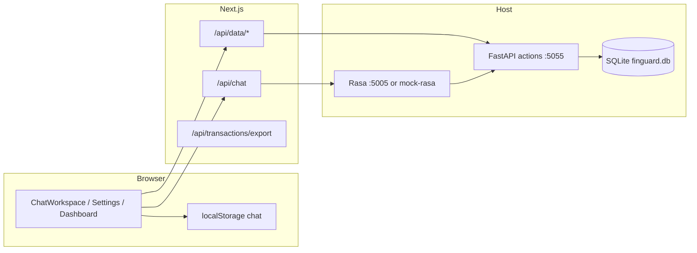

# Finguard — Comprehensive Test Strategy

**Audience:** QA/QC, engineering
**Last reviewed:** 2026-05-28
**Scope:** Monorepo (`frontend/`, `backend/`, `backend/rasa/`, `scripts/`, CI)

This document is the master plan to cover **every meaningful behavior** with the right test type. It follows TDD (red → green → refactor) for new work and extends existing Vitest, pytest, and Rasa e2e coverage.

---

## 1. Executive summary

### Current state (implemented)

| Layer | Tool | Tests today | CI |
|-------|------|-------------|-----|
| Frontend unit | Vitest | **65** (16 files) | ✅ `pnpm test` |
| Backend unit + DB | pytest | **63** (~15 modules) | ✅ `uv run pytest` |
| Rasa CALM e2e | `rasa test e2e` (YAML) | **5** core + **4** flow files | ⭕ manual / `workflow_dispatch` |
| Integration | shell + pytest | `integration-chat.sh`, `test_mock_rasa.py`, confirm SQLite | ⭕ smoke when Next up |
| Browser E2E | Playwright | **7** specs | ⭕ `make test-e2e` locally |
| Contract / schema | golden JSON fixtures | **5** fixture-driven tests | ✅ via Vitest |

**Coverage (latest run):**

| Package | Line coverage | Command |
|---------|---------------|---------|
| `actions/` | **89%** | `cd backend && uv run pytest tests/ --cov=actions --cov-report=term-missing` |
| `frontend/src` (instrumented) | **~81%** statements | `cd frontend && pnpm test:coverage` |

### Target pyramid (steady state)

```
        ~5%  Browser E2E (Playwright) — critical user journeys
       ~15%  Integration — API routes, SQLite, Rasa webhook + actions
      ~80%  Unit — pure logic, handlers (mocked DB), mappers, validators
```

### Quality gates (Definition of Done for features)

1. **RED:** Failing test(s) that describe the behavior before implementation.
2. **GREEN:** Minimal code; all existing + new tests pass.
3. **REFACTOR:** No behavior change; lint/typecheck clean.
4. **Boundary:** Any new HTTP or webhook contract has a golden fixture or route test.
5. **Flow:** Any new Rasa flow has at least one e2e case (stubbed actions in CI).

---

## 2. System under test — behavior map



### Critical paths (must never break)

| ID | Journey | Layers touched |
|----|---------|----------------|
| CP-1 | User sends expense → pending card → confirm → appears in sidebar | Rasa/mock → webhook map → UI → SQLite |
| CP-2 | User asks balance / spending report | Rasa → actions → map report → Dashboard |
| CP-3 | User discards pending | Rasa → delete handler → UI tx status |
| CP-4 | Page load hydrates transactions + chat from storage/API | `/api/data/*`, localStorage |
| CP-5 | Settings save profile | PATCH profile → Rasa slots on next session |
| CP-6 | Export CSV | GET export route → transactions |

---

## 3. Test types and when to use them

| Type | Size | Purpose | Tools in this repo |
|------|------|---------|-------------------|
| **Unit** | Small (ms) | Pure functions, handler logic with mocked DB | Vitest, pytest, `@vitest/mocker`, `unittest.mock` |
| **Contract** | Small | Stable JSON shapes (Rasa custom payloads, API errors) | Vitest + `fixtures/*.json`, optional JSON Schema |
| **API integration** | Medium (s) | Real SQLite / TestClient, no browser | `httpx`/`TestClient`, temp DB file |
| **Service integration** | Medium | Next route → real actions on localhost | Vitest + mocked proxy; `scripts/integration-chat.sh` |
| **Rasa e2e** | Medium–Large | Flow routing, slot collection, assertions | `backend/rasa/tests/*.yml`, stub custom actions |
| **Smoke** | Medium | “Stack boots” after deploy/dev | `scripts/smoke-e2e.sh`, `check-health.sh` |
| **Browser E2E** | Large | Full UX, a11y, regressions | Playwright (`frontend/tests/e2e/`) |
| **Non-functional** | Large | Rate limits, load, security | k6 optional; OWASP ZAP optional |

**TDD rule:** For every bug in production, add a **failing** test at the lowest layer that can catch it, then fix.

---

## 4. Coverage inventory (as-is vs gaps)

### 4.1 Frontend (`frontend/src`)

| Module / behavior | Covered? | Existing tests | Priority gaps |
|-------------------|----------|----------------|---------------|
| `map-rasa-responses.ts` | ✅ | `map-rasa-responses.test.ts`, contract fixtures | generative rephrasing if enabled |
| `map-rasa-report-data.ts` | ✅ | `map-rasa-report-data.test.ts` | — |
| `map-api-messages.ts` | ✅ | `map-api-messages.test.ts` | — |
| `schemas.ts` / `parseChatRequest` | ✅ | `schemas.test.ts` | max length if added |
| `rate-limit.ts` | ✅ | `rate-limit.test.ts` | — |
| `resolve-user.ts` | ✅ | `resolve-user.test.ts` | — |
| `actions/proxy.ts` | ✅ | `proxy.test.ts` | — |
| `/api/chat` route | ✅ | `route.test.ts` | timeout simulation |
| `/api/data/transactions` | ✅ | route mock test | — |
| `/api/data/profile` | ✅ | `profile/route.test.ts` | — |
| `/api/transactions/export` | ✅ | `export/route.test.ts` | — |
| `financial-data.ts` | Partial | `financial-data.test.ts` | full fetch integration |
| `chat-storage.ts` | ✅ | `chat-storage.test.ts` | — |
| `categories.ts` | ✅ | `categories.test.ts` | — |
| `finance-calculations.ts` | ✅ | `finance-calculations.test.ts` | — |
| `ChatWorkspace.tsx` | E2E | Playwright | RTL optional |
| `InputBar`, `MessageBubble` | E2E | Playwright | — |
| `DashboardPanel` / `ReportCard` | Partial | Playwright sidebar | dedicated RTL |
| `settings/page.tsx` | ✅ | Playwright `settings-profile.spec.ts` | — |
| `useSession.ts` | Trivial | — | until auth |

### 4.2 Backend actions (`backend/actions`)

| Module / behavior | Covered? | Existing tests | Priority gaps |
|-------------------|----------|----------------|---------------|
| `handlers/*` | ✅ | unit + `test_confirm_flow_integration.py` | edit-flow partial updates |
| `utils/categories.py` | ✅ | `test_categories.py` | — |
| `utils/formatting.py` | ✅ | `test_formatting.py` | — |
| `db/queries.py` | ✅ | `test_db/test_queries.py` | edge periods |
| `db/schema.py` | ✅ | via queries bootstrap | dedicated idempotent test |
| `server.py` REST `/data/*` | ✅ | `test_server_data.py` | — |
| `models/transaction.py` | Partial | via handlers | direct validator tests |

### 4.3 Rasa CALM (`backend/rasa`)

| Flow / behavior | E2E case? | Notes |
|-----------------|-----------|--------|
| `record_expense` | ✅ | stub `action_record_transaction` |
| `record_income` | ✅ | `tests/flows/test_record_income.yml` |
| `confirm_pending_transaction` | ✅ | fixture `pending_transaction` |
| `discard_pending_transaction` | ✅ | |
| `edit_pending_transaction` | ✅ | `tests/flows/test_edit_pending.yml` |
| `no_pending_transaction` | ✅ | |
| `query_spending_report` | ✅ | |
| `get_balance` | ✅ | `tests/flows/test_get_balance.yml` |
| `list_recent_transactions` | ✅ | `tests/flows/test_list_transactions.yml` |
| Slot rejections (amount ≤ 0) | ❌ | optional |
| Pattern / out-of-scope | ❌ | optional |

**Run:** `RASA_PRO_BETA_STUB_CUSTOM_ACTION=true rasa test e2e` (see Rasa skill) or `.github/workflows/rasa-e2e.yml` when license secret is set.

### 4.4 Scripts & dev tooling

| Script | Test approach |
|--------|----------------|
| `mock-rasa.py` | ✅ `tests/test_mock_rasa.py` (HTTP, `MOCK_RASA_PORT`) |
| `integration-chat.sh` | manual / smoke when Next on :3000 |
| `playwright-webserver.sh` | used by Playwright `webServer` |
| `ensure-local-backend.sh` | CI smoke: ports come up |

---

## 5–9. (Specifications unchanged in spirit — see git history for full detail)

Phase 0–2 deliverables are **implemented**. Phase 3 Playwright specs are **implemented** (7 tests). Optional follow-ups: auth tests (T3-3), nightly Playwright in CI, k6 load tests.

---

## 7. Phased implementation roadmap

### Phase 0 — ✅ Complete

| ID | Deliverable | Status |
|----|-------------|--------|
| T0-1 | `finance-calculations.test.ts` | ✅ |
| T0-2 | `tests/test_db/test_queries.py` | ✅ |
| T0-3 | `tests/test_server_data.py` | ✅ |
| T0-4 | `/api/chat` route error paths | ✅ |
| T0-5 | `map-api-messages.test.ts` | ✅ |

### Phase 1 — ✅ Complete

| ID | Deliverable | Status |
|----|-------------|--------|
| T1-1 | Golden fixtures | ✅ |
| T1-2 | `schemas.test.ts`, `rate-limit.test.ts` | ✅ |
| T1-3 | `financial-data.test.ts` | ✅ |
| T1-4 | Extend `map-rasa-responses` | ✅ |
| T1-5 | `test_categories.py`, `test_formatting.py` | ✅ |

### Phase 2 — ✅ Complete

| ID | Deliverable | Status |
|----|-------------|--------|
| T2-1 | 4 new e2e YAML flow files | ✅ |
| T2-2 | `rasa-e2e` CI workflow (dispatch) | ✅ |
| T2-3 | `scripts/integration-chat.sh` | ✅ |
| T2-4 | Handler + SQLite integration | ✅ |
| T2-5 | `test_mock_rasa.py` | ✅ |

### Phase 3 — ✅ Complete (core)

| ID | Deliverable | Status |
|----|-------------|--------|
| T3-1 | Playwright CP-1, CP-3 | ✅ |
| T3-2 | Settings + export specs | ✅ |
| T3-3 | Auth tests when Supabase returns | deferred |
| T3-4 | Coverage thresholds | ✅ Vitest 70% / pytest `--cov=actions` |

---

## 8. Traceability matrix (flows → tests)

| CALM flow | Unit (handler) | DB integration | Rasa e2e | Playwright |
|-----------|----------------|----------------|----------|------------|
| `record_expense` | ✅ | ✅ | ✅ | ✅ |
| `record_income` | ✅ | ✅ | ✅ | ⭕ |
| `confirm_pending_transaction` | ✅ | ✅ | ✅ | ✅ |
| `discard_pending_transaction` | ✅ | ✅ | ✅ | ✅ |
| `edit_pending_transaction` | ⭕ | ⭕ | ✅ | ⭕ |
| `no_pending_transaction` | ✅ | — | ✅ | ⭕ |
| `query_spending_report` | ✅ | ⭕ | ✅ | ⭕ |
| `get_balance` | ✅ | ⭕ | ✅ | ⭕ |
| `list_recent_transactions` | ✅ | ⭕ | ✅ | ⭕ |

---

## 11. Metrics & reporting

| Metric | Target (3 months) | Current |
|--------|-------------------|---------|
| Frontend unit tests | 60+ | **65** ✅ |
| Backend unit + db tests | 80+ | **63** (close; add handler edge cases) |
| Rasa e2e cases | 12+ | **9+** flow files (run with Pro license) |
| Playwright specs | 6+ | **7** ✅ |
| `actions/` line coverage | 70%+ | **89%** ✅ |

---

## 13. Commands reference

```bash
# Unit
pnpm test                                    # frontend Vitest
cd backend && uv run pytest tests/ -q        # backend

# Coverage
make test-coverage
cd frontend && pnpm test:coverage
cd backend && uv run pytest tests/ --cov=actions --cov-report=term-missing

# Browser E2E (starts mock stack + Next)
make test-e2e

# Integration smoke
./scripts/smoke-e2e.sh
./scripts/integration-chat.sh   # requires Next + mock Rasa
./scripts/check-health.sh

# Rasa e2e (Pro + stubs)
cd backend
export RASA_PRO_BETA_STUB_CUSTOM_ACTION=true
docker compose run --rm rasa test e2e tests/

# Full local stack
make dev
```
