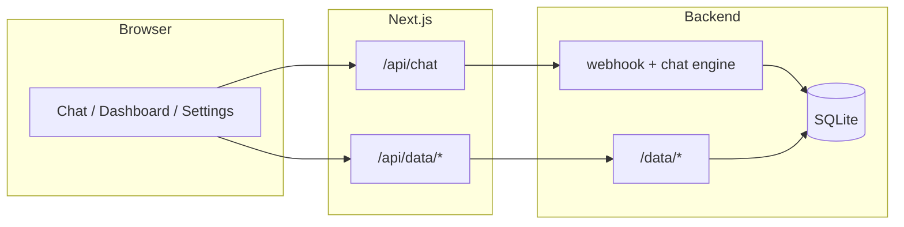

# Test strategy

**Audience:** Engineering
**Last reviewed:** 2026-05-28
**Scope:** `frontend/`, `backend/`, `scripts/`, CI

How we test Finguard: right layer, TDD for new behavior, golden contracts at boundaries.

---

## 1. Summary

| Layer | Tool | CI |
|-------|------|-----|
| Frontend unit | Vitest (~67 tests) | `pnpm test` |
| Backend unit + DB | pytest (~46 tests) | `uv run pytest tests/` |
| Chat integration | `tests/test_chat/*`, `smoke-e2e.sh` | `make smoke` |
| Contract | Golden JSON + [chat-payloads.json](./schemas/chat-payloads.json) | Vitest |
| Browser E2E | Playwright (7 specs) | `make test-e2e` (local) |

### Pyramid

```text
        ~5%  Playwright — record → confirm → sidebar
       ~15%  Integration — webhook + SQLite + /api/chat
      ~80%  Unit — router, services, mappers, queries
```

### Definition of done (features)

1. Failing test(s) first (RED), then implementation (GREEN).
2. Lint and typecheck clean.
3. New webhook or API shapes: golden fixture or schema update.
4. New chat intents: utterance in `tests/fixtures/utterances.jsonl` + router test.

---

## 2. System under test



### Critical paths

| ID | Journey |
|----|---------|
| CP-1 | Expense → pending card → confirm → sidebar |
| CP-2 | Balance / spending report in dashboard |
| CP-3 | Discard pending transaction |
| CP-4 | Hydrate transactions + chat on load |
| CP-5 | Settings → profile PATCH |
| CP-6 | CSV export |

---

## 3. Backend (`backend/tests/`)

| Area | Tests | Notes |
|------|-------|-------|
| `test_chat/test_router.py` | Intent + utterance bank | ≥85% accuracy on fixtures |
| `test_chat/test_webhook.py` | Webhook payloads | |
| `test_chat/test_confirm_webhook.py` | Record → confirm | SQLite integration |
| `test_services/` | Service layer | DB fixtures |
| `test_db/test_queries.py` | SQL | Temp `FINGUARD_DB_PATH` |
| `test_server_data.py` | `/data/*` REST | TestClient |

---

## 4. Frontend (`frontend/src`)

| Area | Tests |
|------|-------|
| `map-rasa-responses.ts` | Unit + golden fixtures in `frontend/src/server/chat/fixtures/` |
| `/api/chat/route.ts` | Proxy + error codes |
| `/api/data/*`, export | Route mocks |
| `finance-calculations`, `categories` | Unit |
| `ChatWorkspace`, settings | Playwright e2e |

---

## 5. Scripts

| Script | Role |
|--------|------|
| `scripts/smoke-e2e.sh` | pytest + backend health + webhook |
| `scripts/integration-chat.sh` | Next `/api/chat` (needs `:3000`) |
| `scripts/check-health.sh` | Port checks |
| `scripts/playwright-webserver.sh` | E2E webServer |
| `backend/scripts/spike_router.py` | Router accuracy report |

---

## 6. Traceability (chat behavior → tests)

| Behavior | Router | Webhook/FSM | Service | Playwright |
|----------|--------|-------------|---------|------------|
| Record expense | ✅ | ✅ | ✅ | ✅ |
| Record income | ✅ | ⭕ | ✅ | ⭕ |
| Confirm pending | ✅ | ✅ | ✅ | ✅ |
| Discard pending | ✅ | ✅ | ✅ | ✅ |
| Edit pending | ✅ | ⭕ | ⭕ | ⭕ |
| Balance report | ✅ | ✅ | ✅ | ⭕ |
| Spending report | ✅ | ✅ | ✅ | ⭕ |
| List transactions | ✅ | ⭕ | ⭕ | ⭕ |

---

## 7. Commands

```bash
make test              # Vitest + pytest
make test-coverage     # with coverage reports
make test-e2e          # Playwright
make smoke             # backend + webhook smoke
./scripts/integration-chat.sh   # needs make dev / Next on :3000
```

---

## 8. Optional follow-ups

- Playwright in CI (nightly or on `workflow_dispatch`)
- Auth tests when Supabase returns
- k6 load tests for `/api/chat` rate limits
