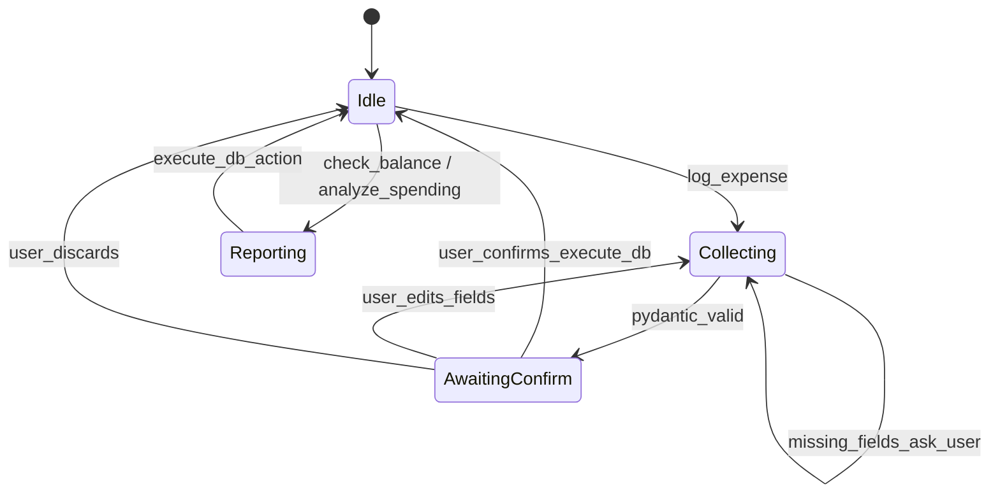

# Low-Cost Conversational Backend Plan

> **Archived:** Migration completed 2026-05-28. See [ARCHITECTURE.md](../../ARCHITECTURE.md).

**Status:** Implemented (2026-05-28)
**Date:** 2026-05-28
**Implementation plan:** [implementation-plan.md](./implementation-plan.md) — phased tasks, Rasa CALM decommission checklist, commit strategy
**Replaces (for licensing reasons):** Rasa CALM + Rasa Pro dependency described in [ARCHITECTURE.md](./ARCHITECTURE.md) and [archive/rasa-calm-backend-plan.md](./archive/rasa-calm-backend-plan.md)

---

## Executive summary

FinGuard’s current stack assumes **Rasa CALM flows** behind `POST /api/chat`. CALM (flows, `collect` steps, LLM command generation) is tied to **Rasa Pro** in practice — the repo already works around this with `mock-rasa.py` and optional `RASA_PRO_LICENSE` in Docker.

This plan proposes a **four-layer Python backend** that keeps the same product goals (deterministic money flows, pending confirmation cards, reports) while **minimizing paid LLM usage**:

| Layer | Role | LLM cost |
|-------|------|----------|
| 1 — Semantic Router | Local intent classification | **$0** |
| 2 — Burr FSM | Dialogue state, transitions, guardrails | **$0** |
| 3 — Instructor + Pydantic | Structured extraction only when needed | **Low** (one call per extract) |
| 4 — SQLite (+ optional DuckDB) | Persist and aggregate | **$0** |

**Verdict:** The layering is sound and matches how FinGuard should behave. The main work is not “new database code” — it is **reimplementing CALM’s multi-turn `collect` and pending-confirmation flows** in Burr while **reusing** existing `backend/actions/` persistence and the frontend webhook contract.

---

## Table of contents

1. [Why leave Rasa CALM](#1-why-leave-rasa-calm)
2. [Fit with current FinGuard](#2-fit-with-current-finguard)
3. [Architecture (4 layers)](#3-architecture-4-layers)
4. [Review feedback](#4-review-feedback)
5. [Gaps to design explicitly](#5-gaps-to-design-explicitly)
6. [Proposed Burr state machine](#6-proposed-burr-state-machine)
7. [Cost model (rough)](#7-cost-model-rough)
8. [Alternatives considered](#8-alternatives-considered)
9. [Migration phases](#9-migration-phases)
10. [Testing strategy](#10-testing-strategy)
11. [Open decisions](#11-open-decisions)
12. [References](#12-references)

---

## 1. Why leave Rasa CALM

| Topic | Reality for this repo |
|-------|------------------------|
| **CALM flows** | Implemented under `backend/rasa/data/flows/` (record expense/income, balance, spending, manage pending). |
| **License** | Full CALM in Docker needs `RASA_PRO_LICENSE`; without it, dev uses `scripts/mock-rasa.py` (limited stubs). |
| **Archived assumption** | [archive/rasa-calm-backend-plan.md](./archive/rasa-calm-backend-plan.md) once claimed “Rasa Open Source 3.9+ is sufficient” for CALM — **treat that as outdated** unless you verify a specific OSS build; operational path here is Pro or mock. |
| **What you keep** | Flow *ideas* (slot collection, rejections, pending card) — not the Rasa runtime. |

**Design principle (unchanged):** Business logic stays deterministic; the LLM only fills structured fields when routing says extraction is required.

---

## 2. Fit with current FinGuard

Reuse as much as possible; replace only the dialogue engine.

| Asset | Keep? | Notes |
|-------|--------|------|
| `backend/actions/db/*`, SQLite schema | **Yes** | Layer 4 should call existing queries/handlers, not duplicate INSERT logic. |
| `backend/actions/handlers/*` | **Yes** | `record_transaction`, confirm/update/delete — already tested (e.g. `test_confirm_flow_integration.py`). |
| `frontend` `/api/chat` + `map-rasa-responses.ts` | **Mostly** | Keep response shapes in [schemas/chat-payloads.json](../../schemas/chat-payloads.json); backend can emit the same `json_message` payloads without Rasa. |
| `backend/rasa/` flows & e2e | **Deprecate** | Replace with Burr graph tests + HTTP contract tests. |
| Docker `rasa` service | **Remove** (later) | Drops Pro license and image weight from local/CI. |
| LiteLLM | **Optional** | Only needed if Layer 3 calls cloud models through a proxy; local Ollama can skip it. |

**Suggested API shape:** One Python service (FastAPI) exposes `POST /webhooks/rest/webhook` compatible with today’s Next.js proxy, *or* a thin rename to `POST /api/chat/backend` with the same JSON body — avoid changing the UI twice.

---

## 3. Architecture (4 layers)

```text
User message
    │
    ▼
┌─────────────────────────────────────┐
│ Layer 1: Semantic Router (local)   │  → intent id: log_expense | check_balance | …
└─────────────────────────────────────┘
    │
    ▼
┌─────────────────────────────────────┐
│ Layer 2: Burr FSM                    │  → which node, what state, when to ask user
└─────────────────────────────────────┘
    │
    ├── analyze_* / check_balance ──────────────┐
    │                                            │ no LLM
    ▼                                            ▼
┌──────────────────────────┐          ┌─────────────────────┐
│ Layer 3: Instructor       │          │ Layer 4: SQLite      │
│ (log_expense / income only)│          │ (+ DuckDB analytics) │
└──────────────────────────┘          └─────────────────────┘
    │                                            │
    └──────────────────┬─────────────────────────┘
                       ▼
              Formatted response (templates / f-strings)
```

### Layer 1: Ingress and routing (Semantic Router)

**Objective:** Classify intent locally with zero API cost and low latency.

Instead of asking an LLM what the user wants, compute embedding distance between the user utterance and predefined **routes**.

**Setup**

- Define routes for core financial actions, e.g.:
  - `log_expense` — “I spent $5 on coffee”, “groceries 50k”
  - `log_income` — “got paid 2000”, “freelance 500”
  - `check_balance`
  - `analyze_spending`
  - `manage_pending` — confirm / edit / discard while a transaction is pending
  - `chitchat` / `unknown`
- Provide **10–30 example utterances per route** (English + Vietnamese amounts/currency patterns if you care about VN usage).

**Implementation**

- Encoder: e.g. `sentence-transformers/all-MiniLM-L6-v2` via Semantic Router’s `HuggingFaceEncoder`.
- Output: route name string consumed by Layer 2.
- **Guardrail:** If top score is below a tuned threshold, route to `unknown` and let Burr ask a clarifying template (still no LLM).

**Limits to plan for**

- Multi-intent in one message (“what’s my balance and log 20k coffee”) — pick primary route or add a cheap decomposition rule later.
- Typos and slang — embeddings help but are not magic; maintain a small keyword fallback for `confirm` / `yes` / `discard`.

### Layer 2: State management and orchestration (Burr)

**Objective:** Deterministic dialogue control; no agentic loops; traceable state.

Burr acts as the **finite state machine**: explicit nodes, transitions, and immutable state updates ([Burr docs](https://burr.dagworks.io/)).

**State variables (initial set)**

| Key | Purpose |
|-----|---------|
| `chat_history` | Recent turns for optional context in extraction |
| `current_intent` | From Layer 1 |
| `dialogue_phase` | e.g. `idle`, `collecting`, `awaiting_confirmation` |
| `partial_transaction` | Fields collected so far |
| `last_transaction_id` | Mirrors Rasa slot for confirm/edit |
| `confirmation_pending` | Boolean guard for manage_pending route |
| `user_id` | From request (same as today’s chat resolver) |

**Nodes (map from existing Rasa flows)**

| Node | Responsibility |
|------|----------------|
| `route_input` | Read intent; set `dialogue_phase` |
| `collect_or_extract` | If required fields missing → call Layer 3 or ask template question |
| `validate_transaction` | Pydantic + business rules (amount > 0, category non-empty) |
| `execute_db_action` | Delegate to existing handlers (pending insert, confirm, reports) |
| `generate_response` | Build text + `json_message` payloads for frontend |

**Graph construction**

- Use `ApplicationBuilder` + `with_transitions`, e.g.
  `("route_input", "collect_or_extract", when(intent="log_expense"))`
- Run **Burr UI** locally during development for transition debugging.

**Why Burr vs “a dict and if statements”**

- Pros: Visualizable graph, persisted state hooks, clearer tests per node.
- Cons: New dependency and learning curve. For ~6 states, a plain Python FSM is acceptable — **Burr earns its keep if flows grow** (edit pending, split transactions, budgets).

### Layer 3: Structured entity extraction (Instructor + Pydantic)

**Objective:** The **only** routine paid-LLM layer — return strict JSON for financial records.

**Setup**

```python
class ExpenseDetail(BaseModel):
    amount: float
    category: str
    description: str | None = None
    transaction_date: date | None = None  # default today in node
```

**Implementation**

- Inside Burr `collect_or_extract`, call Instructor-patched client (`instructor.from_openai` or provider equivalent).
- `response_model=ExpenseDetail` — validation failures trigger Instructor retries (cap retries in config to control cost).
- Prefer **small / cheap models**: Gemini Flash, GPT-4o-mini, or local Llama via Ollama for dev.

**When Layer 3 is skipped**

- `check_balance`, `analyze_spending` → SQL only.
- User says “confirm” while `confirmation_pending` → no extraction.
- High-confidence regex for simple amounts (“spent 50k on food”) — optional fast path before LLM.

### Layer 4: Execution and storage (SQLite + optional DuckDB)

**Objective:** Secure local persistence and fast aggregates.

**Already in repo**

- `backend/data/finguard.db`, handlers in `backend/actions/`.

**OLTP**

- `execute_db_action` writes pending/confirmed rows through existing handler code.

**OLAP**

- For `analyze_spending`, query via existing Python SQL or attach DuckDB to SQLite for heavier analytics — **optional for v1**; current `get_spending_by_category` may be enough.

**Responses**

- Prefer **template strings** for reports (“You spent {total} {currency} in {period}”) to avoid a second LLM call for wording.
- Emit the same structured payloads the UI already maps: `transaction_pending`, `balance`, `spending_report` (see [schemas/chat-payloads.json](../../schemas/chat-payloads.json)).

---

## 4. Review feedback

### Strengths

1. **Cost discipline is correct** — routing and dialogue are separated from extraction; aligns with CALM’s intent without CALM’s license.
2. **Matches FinGuard’s risk profile** — money actions should not be free-form agent tool loops.
3. **Instructor at the boundary** — same pattern as “structured outputs” in your archived prototype docs; better than regex JSON parsing.
4. **Layer 4 is largely done** — plan should explicitly say “wire Burr to existing actions,” not greenfield SQLite.

### Risks and mitigations

| Risk | Severity | Mitigation |
|------|----------|------------|
| Semantic Router misroutes | Medium | Threshold + `unknown` path; log misroutes; unit tests per route with paraphrases |
| Multi-turn slot filling harder than one-shot extract | **High** | Model `collecting` phase in Burr; ask one missing field at a time (mirror Rasa `collect` + `rejections`) |
| Pending confirmation regression | **High** | Port `confirmation_pending` / `last_transaction_id` semantics first; keep golden webhook fixtures |
| Vietnamese / mixed language | Medium | Add VN examples to routes; consider `multilingual-e5-small` if MiniLM underperforms |
| Burr operational overhead | Low–Medium | Spike one flow before committing; document graph in repo |
| Instructor retry storms | Medium | Max retries, timeout, fallback utterance “couldn’t parse, try amount and category” |

### Minor corrections to original draft

- **References `[1]` `[2]`** — replace with linked docs in [References](#12-references).
- **Gemini 1.5 Flash** — verify current model name/API where you implement (Flash families rename often).
- **“100% deterministic state”** — state transitions are deterministic; **extracted field values** are probabilistic until validated by Pydantic and business rules.

---

## 5. Gaps to design explicitly

These exist in Rasa today but were not spelled out in the first draft:

1. **Income vs expense** — separate routes or one `log_transaction` route with `type` in the Pydantic model.
2. **Pending lifecycle** — states: `pending_confirmation` → confirm | edit | discard (see `manage_pending` flow and UI card).
3. **Rejections** — e.g. `amount <= 0` → `utter_ask_amount` equivalent (template node, no LLM).
4. **Session stickiness** — while `confirmation_pending`, Layer 1 should prefer `manage_pending` for short replies (“yes”, “change amount to 30”).
5. **Profile context** — currency/timezone from SQLite profile for reports (Settings page copy already mentions this).
6. **Chitchat** — polite template + redirect (“I can log expenses or show spending…”).
7. **Observability** — structured logs per turn: `intent`, `route_score`, `burr_node`, `llm_tokens` (if any).

---

## 6. Proposed Burr state machine

High-level graph for the **record expense** path (simplest vertical slice):



**Parity checklist vs `record_transaction.yml`**

- [ ] `amount`, `category`, `description`, `transaction_date` collection
- [ ] Rejection when `amount <= 0`
- [ ] `action_record_transaction` → pending row + `transaction_pending` payload
- [ ] Confirm path updates status to `confirmed`
- [ ] Edit pending without starting a new transaction

---

## 7. Cost model (rough)

Assumptions: ~30 chat turns/day, single user dev; extraction on ~40% of turns.

| Approach | Typical cost driver |
|----------|---------------------|
| **Rasa CALM (Pro)** | License + 2× LLM calls per turn (command gen + collects) |
| **This plan** | ~0.4 × (1 small extraction call) per turn; routing/FSM free |

Example (cloud LLM extraction only):

- 12 extractions/day × ~500 tokens ≈ 6k tokens/day → well within free tiers for Flash-class models.
- **Dominant cost becomes your time**, not tokens — unless you add open-ended chitchat LLM replies (don’t).

Local dev: run Layer 3 against Ollama → **$0** with slower iteration.

---

## 8. Alternatives considered

| Option | When it wins | Why not default for FinGuard |
|--------|----------------|-------------------------------|
| **Rasa Pro + CALM** | Enterprise support, CALM Studio, existing investment | License cost; you already hit the wall |
| **Traditional Rasa OSS (DIET + stories)** | No LLM, mature | High training-data burden; worse multilingual UX than embeddings |
| **Pure LLM agent (tools)** | Open-ended tasks | Hard to guarantee confirm-before-spend; higher token burn |
| **LangGraph** | Team already on LangChain | Heavier stack; Burr is smaller if you only need FSM |
| **Plain Python FSM + semantic-router** | Minimal deps | Fine for MVP; refactor to Burr when graphs grow |
| **Keep mock-rasa only** | UI/demo | No real NLU or multi-turn finance logic |

---

## 9. Migration phases

| Phase | Deliverable | Frontend change |
|-------|-------------|-----------------|
| **0 — Spike** | Router accuracy report on 50 labeled utterances; one Burr path in notebook/script | None |
| **1 — Record expense** | FastAPI webhook + Burr + Instructor + existing `record_transaction` handler | Point `RASA_URL` to new service |
| **2 — Reports** | Balance + spending without LLM | None if payloads unchanged |
| **3 — Pending manage** | Confirm / edit / discard | None |
| **4 — Decommission Rasa** | Remove Docker rasa service, update ARCHITECTURE, archive `backend/rasa/` | Docs only |
| **5 — CI** | Replace `rasa test e2e` with pytest + contract fixtures | Workflow update |

**Do not big-bang.** Keep `mock-rasa.py` until Phase 1 webhook passes the same tests as [map-rasa-contract.test.ts](../frontend/src/server/chat/map-rasa-contract.test.ts).

---

## 10. Testing strategy

Align with [TEST_STRATEGY.md](./TEST_STRATEGY.md):

| Layer | Test type |
|-------|-----------|
| Semantic Router | Unit: utterance → expected route (include VN/EN) |
| Burr | Unit per node; integration: multi-turn scripts |
| Instructor | Unit with mocked LLM; contract: schema violations retry |
| DB | Reuse existing `backend/tests/test_db/*`, handler tests |
| HTTP | Golden files in `frontend/src/server/chat/fixtures/` |
| E2E | Playwright: chat → pending card → confirm → sidebar (when Next is up) |

**Remove dependency on** `RASA_PRO_LICENSE` for CI green — major win for this plan.

---

## 11. Open decisions

Record answers here as you decide:

| # | Question | Options |
|---|----------|---------|
| D1 | Single Python service vs split router/FSM processes? | Monolith recommended for local-first |
| D2 | Webhook-compatible URL vs new API? | Compatible = less frontend churn |
| D3 | Burr vs minimal FSM for v1? | Spike in Phase 0 |
| D4 | Local LLM only vs Gemini Flash? | Ollama dev / Flash prod |
| D5 | DuckDB in v1? | Defer unless SQL aggregates hurt |
| D6 | Archive or delete `backend/rasa/` after Phase 4? | Archive first |

---

## 12. References

- [Semantic Router](https://github.com/aurelio-labs/semantic-router) — embedding-based intent routing
- [Burr](https://burr.dagworks.io/) — stateful applications / FSM orchestration
- [Instructor](https://python.useinstructor.com/) — structured LLM outputs with Pydantic
- [Rasa CALM concepts](https://rasa.com/docs/learn/concepts/calm/) — what you are replicating in Burr
- FinGuard: [ARCHITECTURE.md](./ARCHITECTURE.md), [schemas/chat-payloads.json](../../schemas/chat-payloads.json), `backend/rasa/data/flows/record_transaction.yml`

---

## Document history

| Date | Change |
|------|--------|
| 2026-05-28 | Initial 4-layer draft |
| 2026-05-28 | Reformatted; added review, migration, FSM parity, repo fit |
